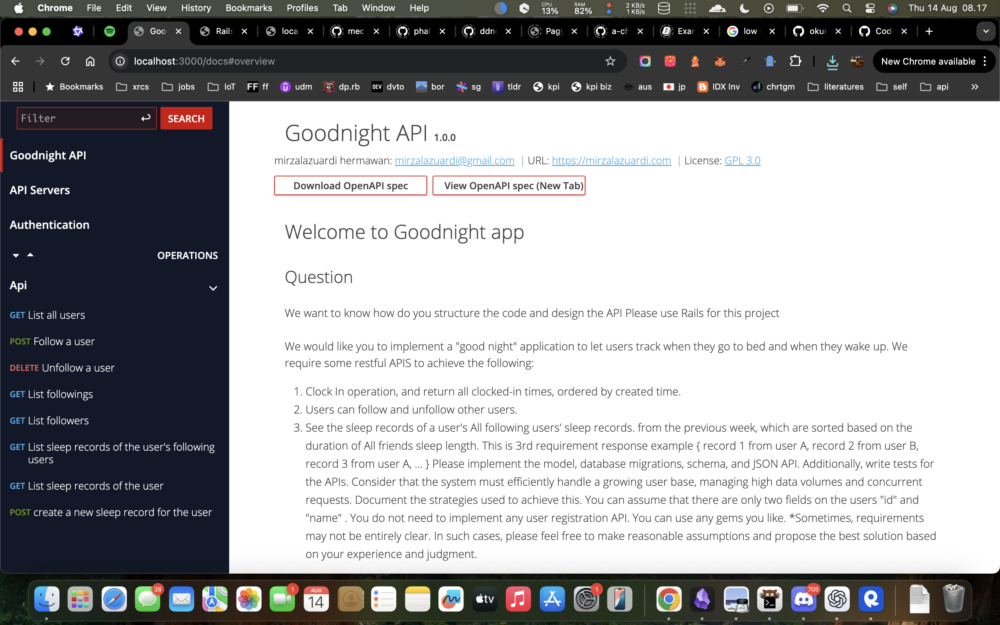

# Goodnight App

## setup

1. After cloning the repository, run the following command to install dependencies:
    ```
    bundle install
    rails db:drop db:create db:migrate db:seed
    ```
2. Start the Rails server:
    ```
    rails server
    ```
3. Open your browser and navigate to `http://localhost:3000/docs`, i'm already provide API documentation on this path,
    this also can hit the endpoints directly from the browser.
4. For check performance of the api endpoints, you can use `https://localhost:3000/rails/performance/`
4. Happy testing!

## API Documentation



## Download endpoints collection

You can download the Postman collection for the Goodnight App API endpoints from the following link:
   [here](./openapi-spec.json)

## spec files

- `spec/requests/api/v1/follows_spec.rb`: Contains tests for the follow API endpoints. *read the NOTE*
- `spec/requests/api/v1/sleep_records_spec.rb`: Contains tests for the sleep records API endpoints.
- `spec/models/follow_spec.rb`: Contains tests for the Follow model.
- `spec/models/sleep_record_spec.rb`: Contains tests for the SleepRecord model.
- `spec/models/user_spec.rb`: Contains tests for the User model.
